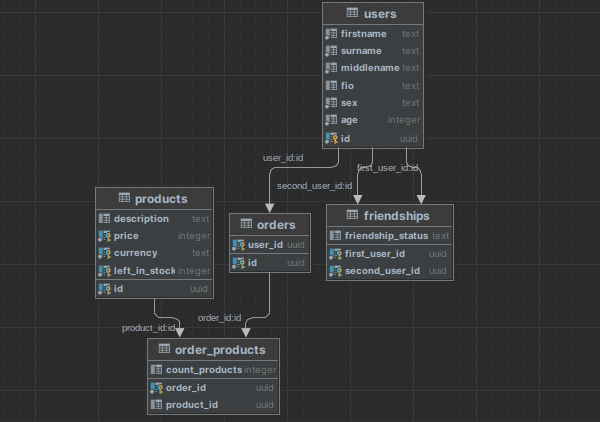

# Go Test Issue

Задача:Необходимо разработать сервис и спроектировать DB (PostgreSQL).

### Инструкция для запуска
Для развертывания сервиса необходимо прописать в терминале корневой папки команду: 
```console
sudo docker-compose up
```
Если необходимо развернуть только базу данных, то необходимо прописать в терминале корневой папки команду:
```console
sudo docker-compose  -f docker-compose.envonly.yml up
```
P.S. При первом запуске при перезапуске контейнера app(он перезапускается, так как не может подключиться к БД, которая еще не инициализирована) могут пропадать логи данного контейнера из консоли. Их можно посмотреть с помощью команды 
```console
sudo docker logs app
```
или перезапустить контейнер с уже работающей БД.
### Структура проекта
#### Структура БД
В качестве БД используется Postgresql 12. Данная БД развернута в docker. Для иницализации БД в docker передается файл config/postgres/init.sql, в котором инициализирована БД( а также триггеры) и добавлены данные в таблицы User и Product. Структура БД реализована в соответствии с заданием (генерации uuid, сбор fio, нельзя заказать продукт на складе, если его нет и т.д.)
ER диаграмма БД представлена на рисунке:


На рисунке представлены связи между сущностями. К примеру, между  orders и product связь many to many,а между users и orders реализована связь one to many.

#### Структура проекта
Модели для каждой сущности для работы с БД прописаны в папке internal/entity/. 

Структура каждого запроса:
* Запрос создания пользователя.Возвращает либо статус 200, либо ошибку. POST http://127.0.0.1:8000/user/create-user. Request Body:
```json
  {
  "firstname":"string",
  "surname":"string",
  "middleName":"string",
  "sex": "string",
  "age": "int"
  }
  ```
* Запрос удаления пользователя (требует id пользователя).Возвращает либо статус 200, либо ошибку. DELETE http://127.0.0.1:8000/user/delete-user. Request Body:
```json
  {
  "id":"string"
  }
  ```
* Запрос обновления пользователя (требует id пользователя).Возвращает либо статус 200, либо ошибку. БД сохраняет новые присланные данные (если данные не изменились, в полях нужно оставить старые значения). PATCH http://127.0.0.1:8000/user/update-user. Request Body:
```json
  {
  "id":"string",
  "firstname":"string",
  "surname":"string",
  "middleName":"string",
  "sex": "string",
  "age": "int"
  }
  ```
* Запрос создания продукта.Возвращает либо статус 200, либо ошибку. POST http://127.0.0.1:8000/product/create-product. Request Body:
```json
  {
  "description":"string",
  "price":"int",
  "currency":"string",
  "left_in_stock": "int"
  }
  ```
* Запрос удаления продукта (требует id продукта).Возвращает либо статус 200, либо ошибку. DELETE http://127.0.0.1:8000/product/delete-product. Request Body:
```json
  {
  "id":"string"
  }
  ```
* Запрос обновления продукта (требует id продукта).Возвращает либо статус 200, либо ошибку. БД сохраняет новые присланные данные (если данные не изменились, в полях нужно оставить старые значения). PATCH http://127.0.0.1:8000/product/update-product. Request Body:
```json
  {
  "id":"string",
  "description":"string",
  "price":"int",
  "currency":"string",
  "left_in_stock": "int"
  }
  ```
* Запрос подписи на пользователя.Возвращает либо статус 200, либо ошибку. Если только первый пользователь подписался на второго, то в бд будет статус  "User 1 follow user 2". Если второй также подписался на первого, то БД будет статус  "Friends".POST http://127.0.0.1:8000/friendship/follow. Request Body:
```json
  {
  "first_user_id": "string",
  "second_user_id": "string"
  }
  ```

* Запрос создания заказа.Возвращает либо статус 200, либо ошибку.Также требуется указать продукты и их количество. POST http://127.0.0.1:8000/order/create-order. Request Body:
```json
  {
  "user_id": "string",
  "products":[
    {
      "id": "string",
      "count": "int"
    }
  ]
  }
  ```
* Запрос удаления заказа (требует id заказа).Возвращает либо статус 200, либо ошибку. DELETE http://127.0.0.1:8000/order/delete-order. Request Body:
```json
  {
  "id":"string"
  }
  ```
* Запрос обновления заказа (требует id заказа).Возвращает либо статус 200, либо ошибку. БД сохраняет новые присланные данные (если данные не изменились,  нужно оставить старые значения). PATCH http://127.0.0.1:8000/order/update-order. Request Body:
```json
  {
  "id":"string",
  "user_id": "string",
  "products":[
    {
      "id": "string",
      "count": "int"
    }
  ]
  }
  ```

#### Тесты
В папке /integration_test находятся тесты создания пользователя и создания продукта. Данные тесты также упакованы в docker и запускаются при развертывании сервиса.

#### Комментарии по проекту
Repo, при желании, можно объединить под одной сущностью ( еще один уровень абстракции, например Client для взаимодействия со всей postgresql, но это нюансы).
Вообще нюансы взимодействия с БД, реализации запросов (и возвращаемые значения) будут зависеть от требований/договоренностей внутри команды.
